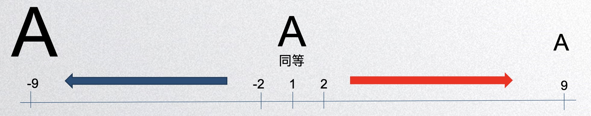

# AHP
*  輸入X為負代表 = 1/X
*  輸入X為正代表 = X
*  輸入為一個Dict型態



<br/>
<br/>

```python

ahp_weight = {
    "test1": 1.6,
    "test2": 2.7,
    "test3": 1,
    "test4": 4,
    "test5": 4,
    "test6": 4,
    "test7": 2,
    "test8": -9
}

ahpw = AHPWeight(ahp_weight)
dict_weight = ahpw.output_weight()
print("AHP Weight:", dict_weight)
print("AHP evaluate:", ahpw.ahp_evaluate())
```

```json
AHP Weight: {'test3': 0.115783, 
            'test2': 0.045868, 
            'test1': 0.073696, 
            'test4': 0.032413, 
            'test5': 0.032413, 
            'test6': 0.032413, 
            'test7': 0.060098, 
            'test8': 0.607317}
AHP evaluate: {'CI': 0.014349066672104322, 
                'CR': 0.010176643029861222
}
```


